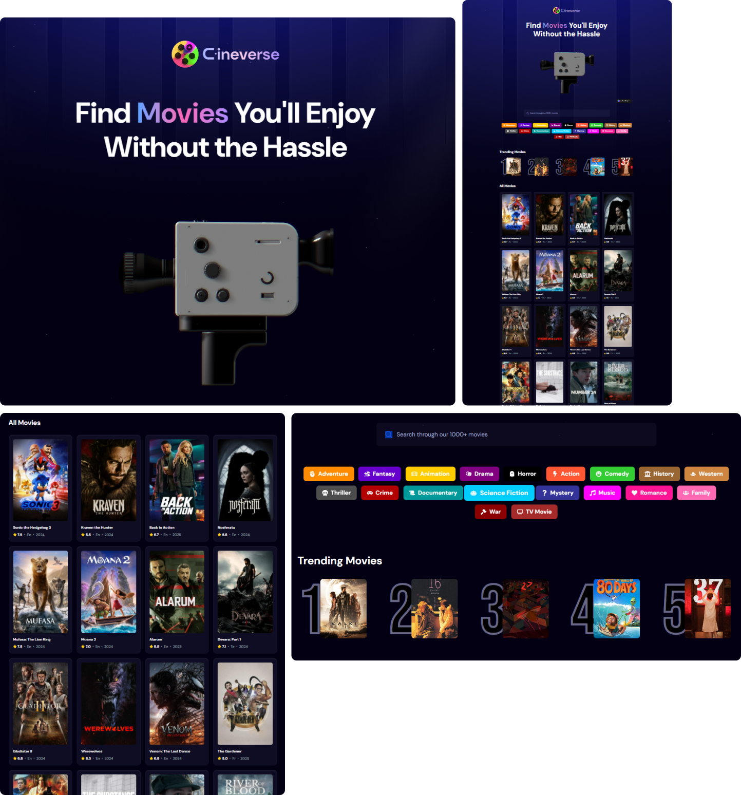

# Cineverse 📽️

A blend of ***Cinema*** and ***Universe*** perfect for a comprehensive movie platform.




## 🍿 Overview
Cineverse is a feature-rich movie searching application that allows users to explore an extensive collection of movies effortlessly. With its genre-based quick search, users can discover movies tailored to their preferences or simply search by name. Cineverse also highlights trending movies based on user searches, showcasing the top 5 most-searched movies dynamically.

## 🎬 Features
- Search by Name: Find your favorite movies by directly searching for them.
- Genre-based Quick Search: Easily browse movies by selecting your preferred genre.
- Trending Movies: A dynamically updated top 5 section, displaying the most searched movies based on real user activity.
- Smooth Animations: Framer Motion ensures fluid animations throughout the app for an engaging user experience.
- 3D Visuals: Integrated Spline 3D models for enhanced aesthetics.
- Interactive Feedback: Lottie animations for delightful micro-interactions.
- Mobile Responsive: Fully optimized for an excellent experience on both desktop and mobile devices.

## 🎦 Tech Stack

### Frontend:

- 💀 React 19: Core framework for building dynamic user interfaces.
- 👻 Tailwind CSS V4: For modern, responsive, and utility-first styling.
- 👽 Lottie: Beautiful animations for user interactions and feedback.
- 👾 Spline: Stunning 3D models for an immersive visual experience.
- 🤖 Framer Motion: Adding smooth animations and transitions to the UI.

### Database:

- 😈 Appwrite (Database): Stores search data to track the most-searched movies and <br /> dynamically updates the top 5 trending movies section.

### Run the Project
```bash
npm install
&
npm run dev
```

### ENV
```dotenv
VITE_TMDB_API_KEY=
VITE_APPWRITE_PROJECT_ID=
VITE_APPWRITE_DATABASE_ID=
VITE_APPWRITE_COLLECTION_ID=
```